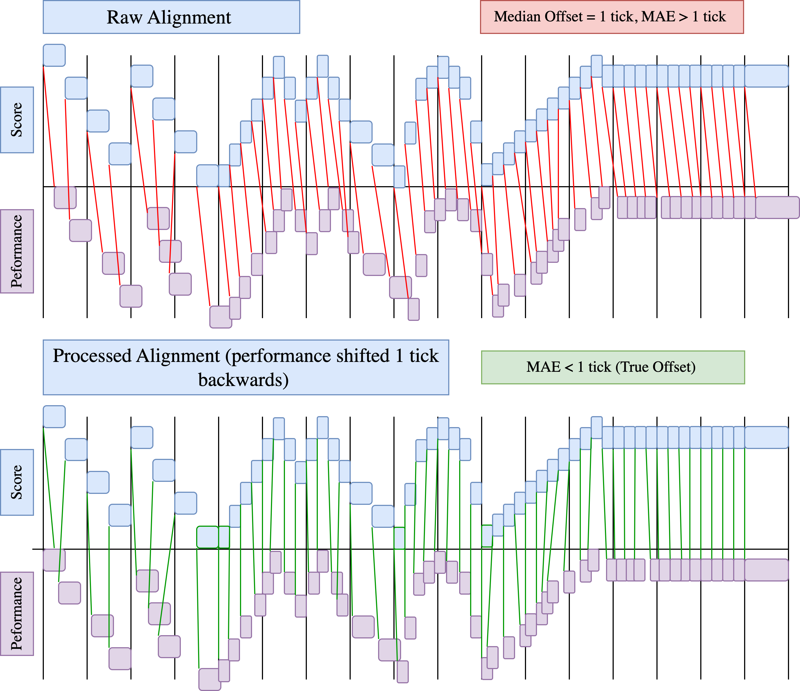
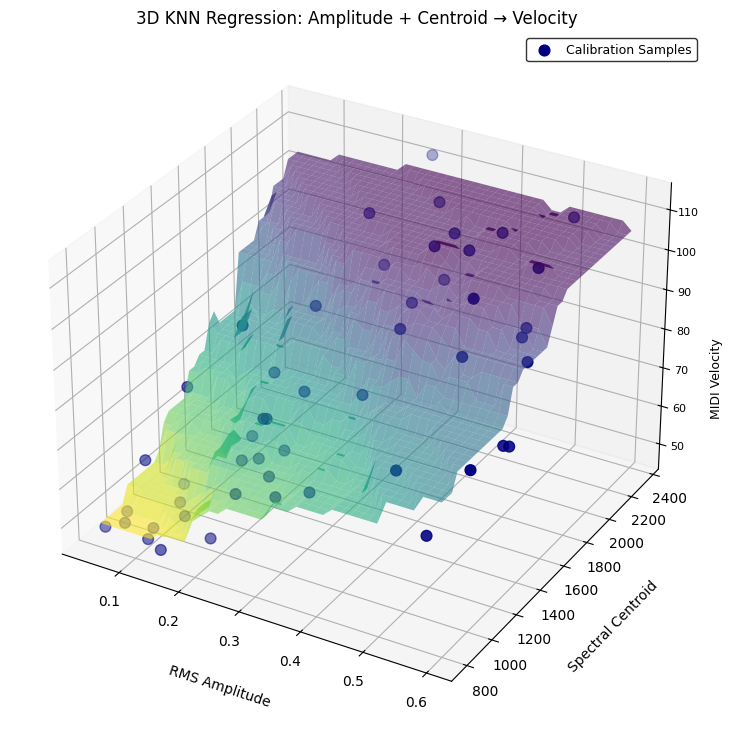

# 🎵 MalletMetrics

**MalletMetrics** is a multimodal AI system designed for **evaluating 
marimba performance**.  
It integrates **automatic transcription, expressive feature modeling, and 
GPT-based feedback** to help musicians understand and improve their 
performances.

---

## Features

- **Automatic Performance Assessment**: Compare student performances to 
reference recordings.
- **Expressive Feature Analysis**: Analyze dynamics, timing, and 
articulation.
- **Visual Feedback**: Graphical representations of performance metrics.
- **Audio-to-Score Alignment**: Accurate transcription of marimba 
recordings.
- **Clustering & Comparison**: Identify trends across multiple 
performances.

## Installation

Clone the repository:

git clone https://github.com/rarangil/MalletMetrics.git
cd MalletMetrics

Create a virtual environment (optional but recommended):

python -m venv venv
Activate the virtual environment:

macOS/Linux
source venv/bin/activate

Windows
venv\Scripts\activate

Install dependencies:

pip install -r requirements.txt

## Usage

### Set up OpenAI API Key

Create a `.env` file in the root folder:

OPENAI_API_KEY=your_openai_api_key_here

Load the key securely in Python:

import os
from openai import OpenAI
from dotenv import load_dotenv

load_dotenv()
client = OpenAI(api_key=os.getenv("OPENAI_API_KEY"))

### Run the Notebook

jupyter notebook notebooks/MalletMetrics.ipynb

## Figures

| Alignment & Fix | Expert vs System |
|-----------------|----------------|
|  |  |

| KNN Regression | System Overview |
|----------------|----------------|
|  |  |

## Project Structure

MalletMetrics/
├── notebooks/ # Main Jupyter notebook
├── src/ # Optional exported Python scripts
├── figures/ # Sample visualizations
├── requirements.txt
├── .gitignore
├── LICENSE
└── README

## License

**MalletMetrics License (Research & Educational Use Only)**

Copyright (c) 2025 Rohit Arangil

Permission is granted for **educational, research, and non-commercial use 
only**.  
Commercial use or distribution is **prohibited without explicit 
permission**.  
All patent rights are **reserved by the copyright holder**.  

See the full [LICENSE](LICENSE) file for details.

## Citation / Acknowledgment

If you use MalletMetrics in your research or projects, please cite it as:

Rohit Arangil, MalletMetrics (2025). Multimodal AI system for marimba 
performance evaluation.

## Contact

Rohit Arangil — [GitHub](https://github.com/rarangil)  

Questions, collaborations, or license inquiries can be sent via GitHub 
Issues or email.
