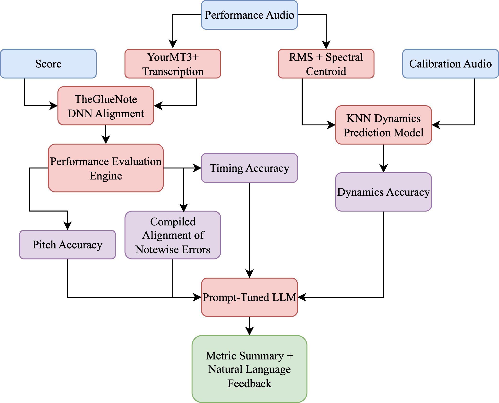
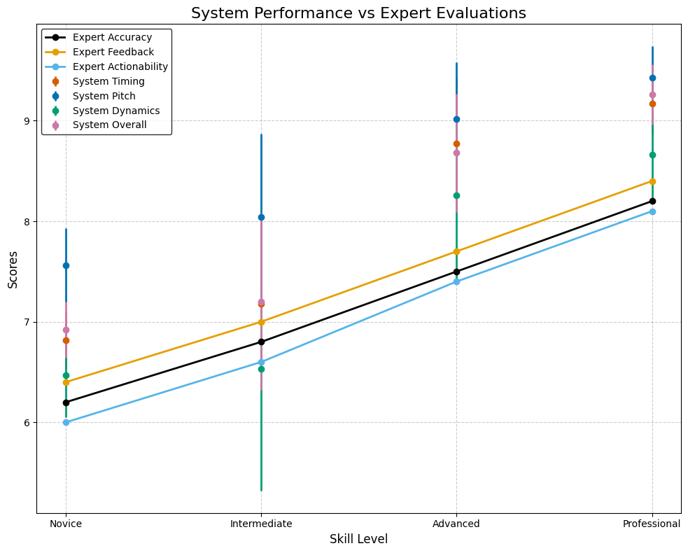

🎵 MalletMetrics

MalletMetrics is an AI-assisted marimba performance assessment tool. It 
analyzes marimba performances for accuracy, timing, and expressive 
features, providing feedback for learners and educators.

Features

Automatic note transcription from audio recordings

Performance accuracy scoring against reference pieces

Expressive feature modeling (dynamics, timing, rhythm)

Optional AI-generated performance feedback

Visualizations of alignment, clustering, and error metrics

Project Structure

MalletMetrics/

notebooks/ – Main Colab notebook

MalletMetrics.ipynb

src/ – Optional Python scripts

malletmetrics.py

figures/ – Sample plots & visualizations

system_overview.png

system_vs_expert.png

knn_regression.png

alignment_and_fix.png

requirements.txt – Python dependencies

.gitignore

LICENSE

README.md

Getting Started

1. Clone the repository
git clone https://github.com/YOURUSERNAME/MalletMetrics.git
cd MalletMetrics

2. Install dependencies
pip install -r requirements.txt

3. Set up your OpenAI API key
Create a .env file in the root folder:

OPENAI_API_KEY=your_api_key_here

The .env file is ignored by Git and keeps your key secure.

4. Run the notebook
Open the notebook in Jupyter:
notebooks/MalletMetrics.ipynb

Or upload it to Colab and run directly.

Sample Visuals
## Visualizations

### System Overview

### Expert vs. System Comparison

### KNN Regression

### Alignment & Fix Example

License

This project is licensed under the MIT License. See LICENSE for details.

Acknowledgments

OpenAI GPT for performance feedback modeling

Parangonar, Partitura, and PrettyMIDI for symbolic music analysis

Inspiration from marimba pedagogy and music technology research
